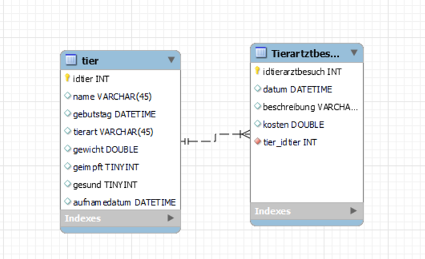
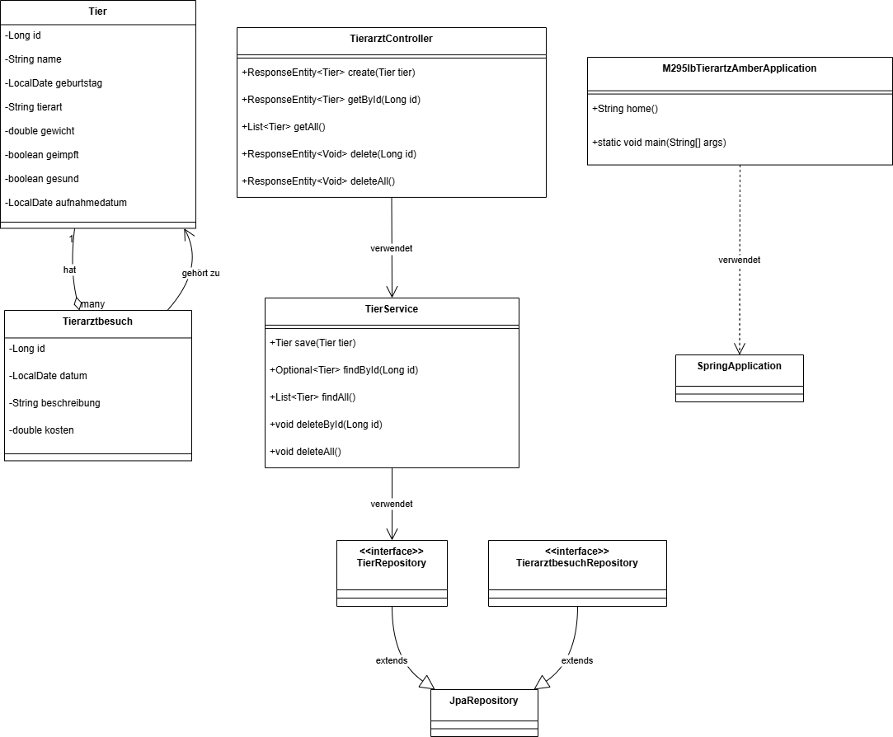
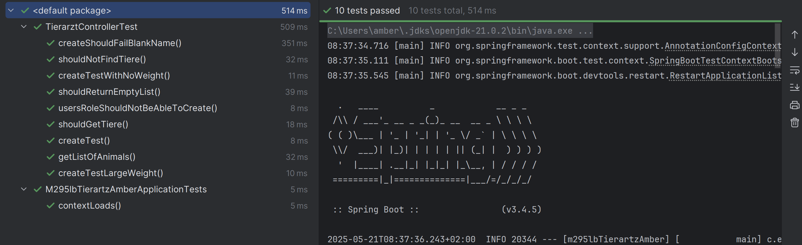

# **_Tierarzt_**

Beschreibung

Dies ist ein Projekt für das verwalten von Tieren

#### **•	«Visuals» Datenbankdiagramm, Klassendiagramm, Screenshot der Testdurchführung**

Datenbankdiagramm

Klassendiagramm

Testing

#### • **Validierungsregeln**

Der Name des Tieres darf nicht leer sein.

Das Tier darf mindesten 0.1 wiegen.

Das Geburtsdatum darf nicht in der Zukunftliegen.

#### •	Berechtigungsmatrix

Ich habe zwei Rollen ausgedacht, der Admin und ein user. Da habe ich eine Table users hinzugefügt.
Das passwort ist admin123.

#### **•	OpenAPI Dokumentation der Services (Resourcen)**

openapi: 3.1.0
info:
title: OpenAPI definition
version: v0
servers:
- url: http://localhost:8080
  description: Generated server url
  paths:
  /api/tiere/{id}:
  get:
  tags:
  - tierarzt-controller
  operationId: getById
  parameters:
  - name: id
  in: path
  required: true
  schema:
  type: integer
  format: int64
  responses:
  "200":
  description: OK
  content:
  '*/*':
  schema:
  $ref: "#/components/schemas/Tier"
  put:
  tags:
  - tierarzt-controller
  operationId: update
  parameters:
  - name: id
  in: path
  required: true
  schema:
  type: integer
  format: int64
  requestBody:
  content:
  application/json:
  schema:
  $ref: "#/components/schemas/Tier"
  required: true
  responses:
  "200":
  description: OK
  content:
  '*/*':
  schema:
  $ref: "#/components/schemas/Tier"
  delete:
  tags:
  - tierarzt-controller
  operationId: delete
  parameters:
  - name: id
  in: path
  required: true
  schema:
  type: integer
  format: int64
  responses:
  "200":
  description: OK
  /api/tiere:
  get:
  tags:
  - tierarzt-controller
  operationId: getAll
  responses:
  "200":
  description: OK
  content:
  '*/*':
  schema:
  type: array
  items:
  $ref: "#/components/schemas/Tier"
  post:
  tags:
  - tierarzt-controller
  operationId: create
  requestBody:
  content:
  application/json:
  schema:
  $ref: "#/components/schemas/Tier"
  required: true
  responses:
  "200":
  description: OK
  content:
  '*/*':
  schema:
  $ref: "#/components/schemas/Tier"
  delete:
  tags:
  - tierarzt-controller
  operationId: deleteAll
  responses:
  "200":
  description: OK
  /:
  get:
  tags:
  - m-295lb-tierartz-amber-application
  operationId: home
  responses:
  "200":
  description: OK
  content:
  '*/*':
  schema:
  type: string
  put:
  tags:
  - m-295lb-tierartz-amber-application
  operationId: home_2
  responses:
  "200":
  description: OK
  content:
  '*/*':
  schema:
  type: string
  post:
  tags:
  - m-295lb-tierartz-amber-application
  operationId: home_1
  responses:
  "200":
  description: OK
  content:
  '*/*':
  schema:
  type: string
  delete:
  tags:
  - m-295lb-tierartz-amber-application
  operationId: home_3
  responses:
  "200":
  description: OK
  content:
  '*/*':
  schema:
  type: string
  options:
  tags:
  - m-295lb-tierartz-amber-application
  operationId: home_6
  responses:
  "200":
  description: OK
  content:
  '*/*':
  schema:
  type: string
  head:
  tags:
  - m-295lb-tierartz-amber-application
  operationId: home_5
  responses:
  "200":
  description: OK
  content:
  '*/*':
  schema:
  type: string
  patch:
  tags:
  - m-295lb-tierartz-amber-application
  operationId: home_4
  responses:
  "200":
  description: OK
  content:
  '*/*':
  schema:
  type: string
  components:
  schemas:
  Tier:
  type: object
  properties:
  id:
  type: integer
  format: int64
  name:
  type: string
  minLength: 1
  geburtstag:
  type: string
  format: date
  tierart:
  type: string
  gewicht:
  type: number
  format: double
  geimpft:
  type: boolean
  gesund:
  type: boolean
  aufnahmedatum:
  type: string
  format: date
  required:
  - name

•	**Autor**: Amber Moore

#### •	**Zusammenfassung** 

Dieses Projekt ist eine Tierarzt Prxi als Spring-Boot-Anwendung.  
Es bietet eine REST-API zur ganzheitlichen Verwaltung von Tieren und ihrer Tierarztbesuche:

- **Tiere**: Anlegen, Auslesen, Aktualisieren, Löschen (CRUD)
- **Tierarztbesuche**: Mehrere Termine pro Tier verwalten
- **Validierung**: Namen nicht leer lassen, Gewicht ≥ 0,1 kg, Geburtstage in der Vergangenheit
- **Sicherheit**: Basic-Auth mit zwei Rollen (USER, ADMIN)
- **Datenbank**: In-Memory mit JPA/Hibernate
- **Dokumentation**: OpenAPI/Swagger UI unter `/swagger-ui.html`